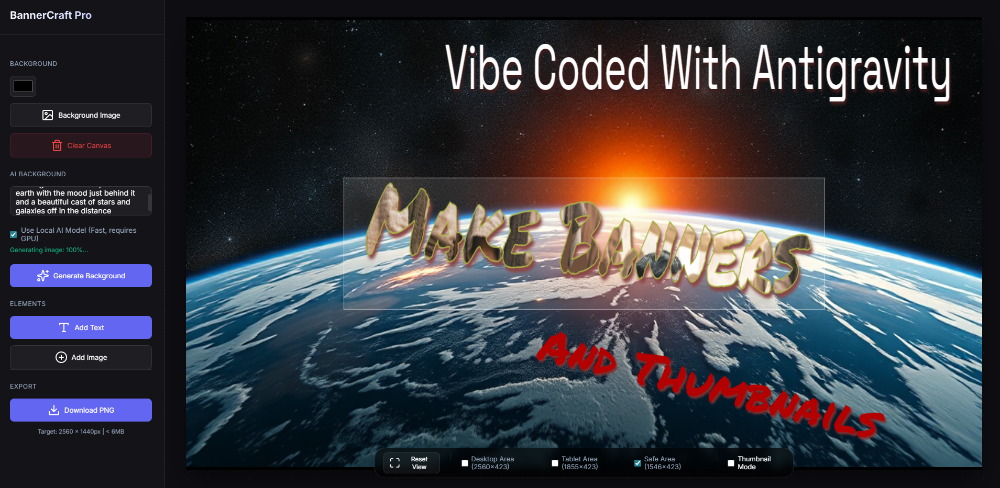

# YouTube Banner Creator - Premium Suite



A professional, high-performance web application designed for creating stunning multi-platform banners and thumbnails. This suite features a modularized architecture, offline-first AI generation capabilities, a robust virtual artboard system, and a high-fidelity cinematic text integration engine.

**Tags**: `python`, `fastapi`, `stable-diffusion`, `youtube-tools`, `javascript`, `fabricjs`

## 🚀 Key Features

### 🎨 Advanced Design Tools
- **Virtual Artboard System**: 
    - Professional-grade workspace allowing elements to be positioned, scaled, and manipulated outside the canvas boundaries.
    - Non-destructive workflow with clear visual feedback for off-canvas assets.
- **Cinematic Text Integration ("Bake In")**:
    - Atmospheric text blending that integrates characters directly into the background lighting.
    - Supports **Soft Light** and **Overlay** blending modes with lighting-aware shadows and glow.
- **Rich Text Engine**: 
    - 50+ Premium Google Fonts with instant cycling and keyboard navigation.
    - Advanced **Drop Shadows** (Blur, X/Y Offset, Color).
    - Dynamic **Border Outlines** (Thickness & Color).
    - **Image Pattern Fills**: Map any uploaded image directly onto your text characters.
- **Multi-Platform Canvas Presets**: 
    - **YouTube**: Banners (2560×1440) and Thumbnails (1280×720).
    - **X (Twitter)**: Headers (1500×500) and Posts (1200×675).
    - **Instagram**: Square Posts (1080×1080) and Stories/Reels (1080×1920).
    - **DistroKid**: Album Covers (3000×3000).
    - **Spotify**: Canvas (1080×1920).
- **Interactive Layers List**:
    - Real-time scrollable list of all design elements. 
    - **Stacking Controls**: Intuitive Z-index management (Move Up/Down).
    - **Layer Effects**: Adjust Opacity, Brightness, Contrast, and Blur per-layer.
- **Canvas Navigation**: 
    - Smooth mouse wheel zoom and middle-mouse button panning.
    - **Reset View**: Instant centering and scaling of the artboard.

### 🤖 Local & Cloud AI Generation
- **Triple Local GPU Model Choice**:
    - **FLUX.1 Schnell**: State-of-the-art geometry and text spelling (Requires ~12GB VRAM).
    - **ERNIE-Image-Turbo**: High-fidelity 8-step generation with memory-optimized 8-bit quantized loading (Requires ~8GB VRAM).
    - **SDXL Lightning**: Ultra-fast 4-step generation for rapid iteration (Requires ~8GB VRAM).
- **Performance Optimized**: Uses `local_files_only` logic and VRAM flushing for near-instant model swaps and execution.
- **Cloud Fallback**: Automatically falls back to high-quality cloud inference if no local GPU is detected.

### 🛠 Technical Excellence
- **Modular Frontend**: Discrete managers (`CanvasManager`, `UIManager`, `AIManager`, `HistoryManager`) for high maintainability.
- **Undo/Redo System**: Robust command-pattern history tracking (Ctrl+Z / Ctrl+Y).
- **Project Management (.jjp)**: Save/Load entire workspaces with embedded assets (Base64) for perfect portability.
- **High-Res Export**: Intelligent quality scaling and platform-specific size checking.

## 📦 Installation & Setup

### ⚙️ Requirements
- **GPU (for Local AI)**: NVIDIA RTX series (8GB+ VRAM). 
- **Python**: 3.10+
- **OS**: Windows (tested)

1. **Clone the Repository**:
   ```bash
   git clone https://github.com/JaJaPain/youtube-banner.git
   ```
2. **Launch**:
   - Simply double-click `run_app.bat`. This will initialize the FastAPI backend, detect your GPU, and launch the frontend in your browser.

## 📖 How to Use

1. **Pick your Preset**: Select your target platform (YouTube, Instagram, etc.) from the **Canvas Preset** dropdown.
2. **Manage your Background**: Expand the **Background** section to set colors, upload images, or generate one with AI.
3. **Cinematic Text**: Add text, then use the **Bake In** button under "Cinematic Text" to blend it artistically into your background.
4. **Interactive Layers**: Use the **Layers List** in the sidebar to select elements that are off-canvas or buried behind others.
5. **Project Safety**: Regularly use **Save Project** to export a `.jjp` file. This is your "Source Code" for the design.
6. **Export**: Click **Download PNG** to save the final flattened image for upload.

## 📄 License
This project is licensed under the MIT License.

---
*Built with ❤️ for Creators.*
